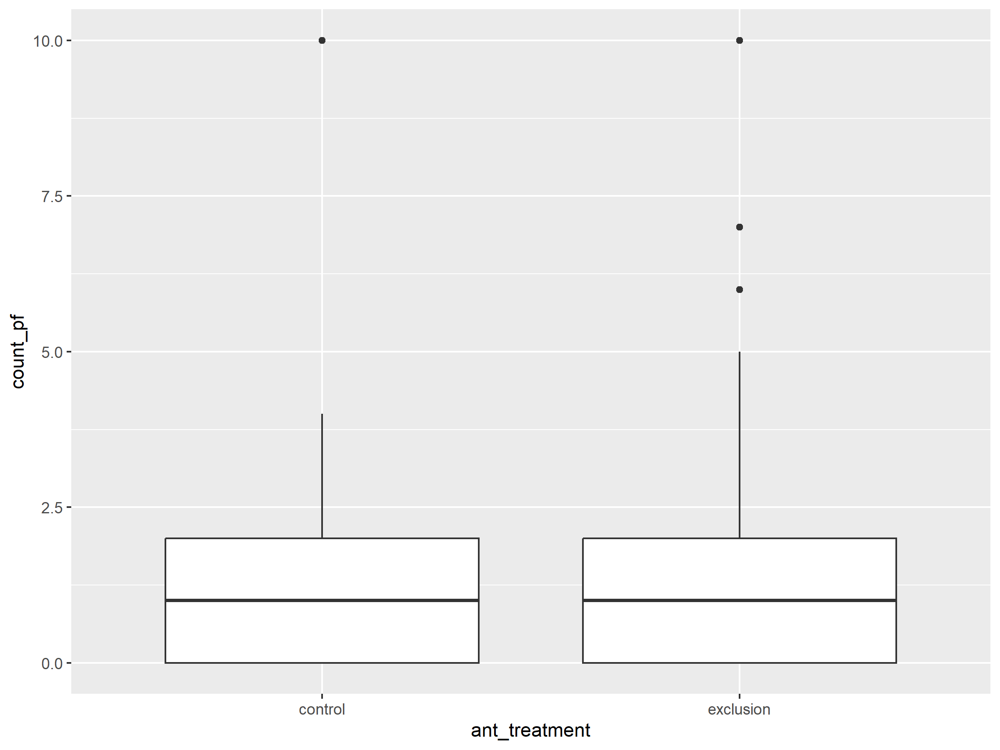
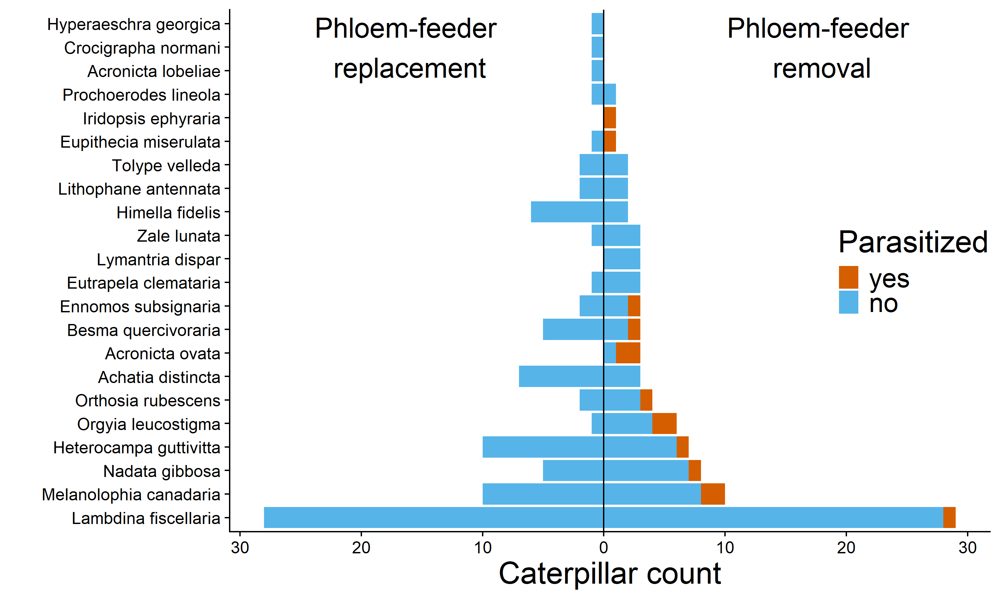

Phloem Feeding Insects Inhibit Caterpillar Parasitism
================
Riley M. Anderson
July 25, 2024

- [Overview](#overview)
- [Natural membracid density in 2022
  (membracids/m2)](#natural-membracid-density-in-2022-membracidsm2)
- [Natural membracid density in 2022
  (membracids/branch)](#natural-membracid-density-in-2022-membracidsbranch)
  - [Membracid density (all sampled
    branches)](#membracid-density-all-sampled-branches)
  - [Membracid density (only branches with
    phloem-feeders)](#membracid-density-only-branches-with-phloem-feeders)
  - [Caterpillar density (all sampled
    branches)](#caterpillar-density-all-sampled-branches)
  - [Ant effects on phloem-feeder
    counts](#ant-effects-on-phloem-feeder-counts)
  - [Branch level model for
    parasitism](#branch-level-model-for-parasitism)
  - [Recovery rates of stocked
    caterpillars](#recovery-rates-of-stocked-caterpillars)
  - [Figure 2:](#figure-2)
    - [proportion recovered-all years](#proportion-recovered-all-years)
    - [counts all years](#counts-all-years)
- [Figure 3](#figure-3)
  - [Supplemental table](#supplemental-table)
  - [Volatiles](#volatiles)
    - [Volatile Plot](#volatile-plot)
  - [Session Information](#session-information)

# Overview

# Natural membracid density in 2022 (membracids/m2)

| Site                          |  mean |    sd |
|:------------------------------|------:|------:|
| Cockaponset pit               | 1.070 | 0.685 |
| Kelseytown Rd Cockaponset     | 3.364 | 2.629 |
| Meshomasic Kongcut Mtn        | 0.869 | 0.454 |
| Portland Reservoir Meshomasic | 1.176 | 0.625 |
| Overall                       | 1.243 | 1.132 |

# Natural membracid density in 2022 (membracids/branch)

|  mean |    sd |
|------:|------:|
| 1.933 | 1.081 |

## Membracid density (all sampled branches)

|  mean |    sd | Nbranches | NPFbranches | freq.PFbranches |
|------:|------:|----------:|------------:|----------------:|
| 0.408 | 0.908 |       125 |          34 |           0.272 |

## Membracid density (only branches with phloem-feeders)

| mean |    sd |
|-----:|------:|
|  1.5 | 1.218 |

## Caterpillar density (all sampled branches)

| mean |    sd |
|-----:|------:|
| 3.12 | 2.632 |

## Ant effects on phloem-feeder counts

<!-- -->

| term          |  df |   deviance | df.residual | residual.deviance |   p.value |
|:--------------|----:|-----------:|------------:|------------------:|----------:|
| NULL          |  NA |         NA |         127 |          250.5686 |        NA |
| ant_treatment |   1 |   0.881928 |         126 |          249.6867 | 0.3476741 |
| site          |   4 | 145.472060 |         122 |          104.2146 | 0.0000000 |

## Branch level model for parasitism

    ## [1] 93
    ## [1] 4
    ## [1] 4
    ## [1] 28
    ##  Family: binomial  ( logit )
    ## Formula:          
    ## para ~ pf_treatment * ant_treatment + year + site + (1 | branchID) +  
    ##     (1 | cat_species)
    ## Data: dat1
    ## 
    ##      AIC      BIC   logLik deviance df.resid 
    ##    105.3    142.8    -40.6     81.3      156 
    ## 
    ## Random effects:
    ## 
    ## Conditional model:
    ##  Groups      Name        Variance  Std.Dev. 
    ##  branchID    (Intercept) 1.284e-09 3.583e-05
    ##  cat_species (Intercept) 7.687e-02 2.773e-01
    ## Number of obs: 168, groups:  branchID, 93; cat_species, 28
    ## 
    ## Conditional model:
    ##                                              Estimate Std. Error z value
    ## (Intercept)                                   -1.2376     0.6156  -2.010
    ## pf_treatmentreplaced                         -21.6179 14357.7283  -0.002
    ## ant_treatmentexcluded                         -0.6315     0.6330  -0.998
    ## year1                                          0.1971     0.9096   0.217
    ## year2                                          0.3474     1.1641   0.298
    ## year3                                         -0.4936     0.9758  -0.506
    ## site1                                          0.2467     1.0360   0.238
    ## site2                                          0.3720     0.7065   0.527
    ## site3                                          0.5563     0.6898   0.806
    ## pf_treatmentreplaced:ant_treatmentexcluded    -2.8872 83440.1644   0.000
    ##                                            Pr(>|z|)  
    ## (Intercept)                                  0.0444 *
    ## pf_treatmentreplaced                         0.9988  
    ## ant_treatmentexcluded                        0.3185  
    ## year1                                        0.8285  
    ## year2                                        0.7654  
    ## year3                                        0.6130  
    ## site1                                        0.8118  
    ## site2                                        0.5985  
    ## site3                                        0.4199  
    ## pf_treatmentreplaced:ant_treatmentexcluded   1.0000  
    ## ---
    ## Signif. codes:  0 '***' 0.001 '**' 0.01 '*' 0.05 '.' 0.1 ' ' 1
    ## [[1]]
    ## [1] "glmmTMB"   "stats"     "graphics"  "grDevices" "utils"     "datasets" 
    ## [7] "methods"   "base"     
    ## 
    ## [[2]]
    ## [1] "glmmTMB"   "stats"     "graphics"  "grDevices" "utils"     "datasets" 
    ## [7] "methods"   "base"     
    ## 
    ## [[3]]
    ## [1] "glmmTMB"   "stats"     "graphics"  "grDevices" "utils"     "datasets" 
    ## [7] "methods"   "base"     
    ## 
    ## [[4]]
    ## [1] "glmmTMB"   "stats"     "graphics"  "grDevices" "utils"     "datasets" 
    ## [7] "methods"   "base"     
    ## 
    ## [[5]]
    ## [1] "glmmTMB"   "stats"     "graphics"  "grDevices" "utils"     "datasets" 
    ## [7] "methods"   "base"     
    ## 
    ## [[6]]
    ## [1] "glmmTMB"   "stats"     "graphics"  "grDevices" "utils"     "datasets" 
    ## [7] "methods"   "base"     
    ## 
    ## [[7]]
    ## [1] "glmmTMB"   "stats"     "graphics"  "grDevices" "utils"     "datasets" 
    ## [7] "methods"   "base"

|                                            |         Est |    mean_est |       2.5% |       97.5% |
|:-------------------------------------------|------------:|------------:|-----------:|------------:|
| (Intercept)                                |  -1.2376355 |  -7.7999305 | -24.014926 |  -0.0689839 |
| pf_treatmentreplaced                       | -21.6178674 | -26.7689752 | -46.978147 | -17.4441690 |
| ant_treatmentexcluded                      |  -0.6315112 |  -0.8064233 |  -2.217989 |   0.6812016 |
| year1                                      |   0.1970723 |   2.3824125 | -15.875004 |  20.9890713 |
| year2                                      |   0.3474126 |   2.1197523 | -22.550709 |  28.9418595 |
| year3                                      |  -0.4936173 |  -5.5906118 | -31.303666 |  14.0752132 |
| site1                                      |   0.2466638 |  -2.6829120 | -24.557098 |  14.6687855 |
| site2                                      |   0.3720153 |   4.4194325 | -11.307061 |  20.0404162 |
| site3                                      |   0.5563021 |   4.0570264 | -12.721602 |  17.1071595 |
| pf_treatmentreplaced:ant_treatmentexcluded |  -2.8871860 |  -2.3994862 |  -9.300318 |   3.4759451 |

    ##                    df       AIC
    ## branch_tmbmod      12 105.26787
    ## branch_tmbmod_main 11 103.26787
    ## branch_tmbmod_pf   10 122.60573
    ## branch_tmbmod_ant  10 102.29463
    ## branch_tmbmod_y     8  97.65110
    ## branch_tmbmod_s     8  99.15821

|                       |     AIC |     BIC | logLik | deviance |  Chisq | Chi Df | Pr(\>Chisq) |
|:----------------------|--------:|--------:|-------:|---------:|-------:|-------:|------------:|
| Site                  |   4.110 |  13.482 |  0.945 |    1.890 |  1.890 |      3 |       0.595 |
| Year                  |   5.617 |  14.989 |  0.192 |    0.383 |  0.383 |      3 |       0.944 |
| Phloem-feeders        | -19.338 | -16.214 | 10.669 |   21.338 | 21.338 |      1 |       0.000 |
| Ants                  |   0.973 |   4.097 |  0.513 |    1.027 |  1.027 |      1 |       0.311 |
| Phloem-feeders x Ants |   2.000 |   5.124 |  0.000 |    0.000 |  0.000 |      1 |       1.000 |

## Recovery rates of stocked caterpillars

| term                                       | estimate | std.error | statistic | p.value |
|:-------------------------------------------|---------:|----------:|----------:|--------:|
| (Intercept)                                |    0.154 |     0.396 |     0.389 |   0.703 |
| pf_treatmentreplaced                       |   -0.067 |     0.439 |    -0.152 |   0.881 |
| ant_treatmentexcluded                      |    0.597 |     0.561 |     1.065 |   0.304 |
| site1                                      |    0.628 |     0.725 |     0.866 |   0.400 |
| site2                                      |    0.247 |     0.509 |     0.485 |   0.635 |
| site3                                      |   -0.503 |     0.527 |    -0.954 |   0.355 |
| year1                                      |   -1.093 |     0.545 |    -2.005 |   0.063 |
| year2                                      |   -0.172 |     0.492 |    -0.349 |   0.732 |
| year3                                      |    0.885 |     0.471 |     1.879 |   0.080 |
| pf_treatmentreplaced:ant_treatmentexcluded |   -1.133 |     0.775 |    -1.463 |   0.164 |

## Figure 2:

### proportion recovered-all years

<!-- -->

### counts all years

<!-- -->

# Figure 3

<!-- -->

## Supplemental table

## Volatiles

### Volatile Plot

<!-- -->

    ## Permutation test for adonis under reduced model
    ## Terms added sequentially (first to last)
    ## Blocks:  strata 
    ## Permutation: free
    ## Number of permutations: 255
    ## 
    ## adonis2(formula = chem[, 5:37] ~ pf_treatment * pf_species, data = chem, permutations = 999, strata = chem$block)
    ##                         Df SumOfSqs      R2      F  Pr(>F)  
    ## pf_treatment             1  0.26862 0.14699 2.5292 0.03125 *
    ## pf_species               1  0.23300 0.12750 2.1938 0.18750  
    ## pf_treatment:pf_species  1  0.05136 0.02810 0.4836 0.72656  
    ## Residual                12  1.27450 0.69741                 
    ## Total                   15  1.82748 1.00000                 
    ## ---
    ## Signif. codes:  0 '***' 0.001 '**' 0.01 '*' 0.05 '.' 0.1 ' ' 1

<!-- -->

    ##      removed replaced MeanDecreaseAccuracy MeanDecreaseGini
    ## C83 5.591947 5.245353             6.196672        0.9311396
    ## C32 4.843608 5.341929             5.701511        0.7449624
    ## C80 3.826946 2.626473             4.202697        0.6531383
    ## C4  1.732092 2.178387             2.218284        0.5677520

<!-- -->

    ##           gini_sp   gini_pf
    ## gini_sp 1.0000000 0.2875914
    ## gini_pf 0.2875914 1.0000000
    ## $C83
    ## 
    ## 
    ## |                        | Df|    Sum Sq|   Mean Sq|   F value|    Pr(>F)|
    ## |:-----------------------|--:|---------:|---------:|---------:|---------:|
    ## |pf_treatment            |  1| 0.0300568| 0.0300568| 9.5051411| 0.0104146|
    ## |pf_species              |  1| 0.0022488| 0.0022488| 0.7111528| 0.4170223|
    ## |pf_treatment:pf_species |  1| 0.0029423| 0.0029423| 0.9304691| 0.3554688|
    ## |Residuals               | 11| 0.0347838| 0.0031622|        NA|        NA|
    ## 
    ## $C32
    ## 
    ## 
    ## |                        | Df|    Sum Sq|   Mean Sq|  F value|    Pr(>F)|
    ## |:-----------------------|--:|---------:|---------:|--------:|---------:|
    ## |pf_treatment            |  1| 0.0450122| 0.0450122| 8.115941| 0.0158293|
    ## |pf_species              |  1| 0.0132926| 0.0132926| 2.396725| 0.1498622|
    ## |pf_treatment:pf_species |  1| 0.0318151| 0.0318151| 5.736419| 0.0355405|
    ## |Residuals               | 11| 0.0610077| 0.0055462|       NA|        NA|
    ## 
    ## $C80
    ## 
    ## 
    ## |                        | Df|    Sum Sq|   Mean Sq|   F value|    Pr(>F)|
    ## |:-----------------------|--:|---------:|---------:|---------:|---------:|
    ## |pf_treatment            |  1| 0.0307364| 0.0307364| 6.1256440| 0.0308462|
    ## |pf_species              |  1| 0.0015434| 0.0015434| 0.3076035| 0.5902530|
    ## |pf_treatment:pf_species |  1| 0.0130204| 0.0130204| 2.5949251| 0.1355045|
    ## |Residuals               | 11| 0.0551942| 0.0050177|        NA|        NA|
    ## 
    ## $C4
    ## 
    ## 
    ## |                        | Df|    Sum Sq|   Mean Sq|   F value|    Pr(>F)|
    ## |:-----------------------|--:|---------:|---------:|---------:|---------:|
    ## |pf_treatment            |  1| 1.0491499| 1.0491499| 8.3314769| 0.0148001|
    ## |pf_species              |  1| 0.0192296| 0.0192296| 0.1527054| 0.7034254|
    ## |pf_treatment:pf_species |  1| 0.2104090| 0.2104090| 1.6708937| 0.2226307|
    ## |Residuals               | 11| 1.3851865| 0.1259260|        NA|        NA|
    ## $C82
    ## 
    ## 
    ## |                        | Df|    Sum Sq|   Mean Sq|   F value|    Pr(>F)|
    ## |:-----------------------|--:|---------:|---------:|---------:|---------:|
    ## |pf_treatment            |  1| 0.0037723| 0.0037723| 1.6486111| 0.2255335|
    ## |pf_species              |  1| 0.0001337| 0.0001337| 0.0584296| 0.8134425|
    ## |pf_treatment:pf_species |  1| 0.0044708| 0.0044708| 1.9538626| 0.1897211|
    ## |Residuals               | 11| 0.0251701| 0.0022882|        NA|        NA|
    ## 
    ## $C90
    ## 
    ## 
    ## |                        | Df|    Sum Sq|   Mean Sq|   F value|    Pr(>F)|
    ## |:-----------------------|--:|---------:|---------:|---------:|---------:|
    ## |pf_treatment            |  1| 0.0079083| 0.0079083| 3.1289976| 0.1045934|
    ## |pf_species              |  1| 0.0010581| 0.0010581| 0.4186346| 0.5308890|
    ## |pf_treatment:pf_species |  1| 0.0000502| 0.0000502| 0.0198529| 0.8904958|
    ## |Residuals               | 11| 0.0278017| 0.0025274|        NA|        NA|
    ## 
    ## $C5
    ## 
    ## 
    ## |                        | Df|    Sum Sq|   Mean Sq|   F value|    Pr(>F)|
    ## |:-----------------------|--:|---------:|---------:|---------:|---------:|
    ## |pf_treatment            |  1| 0.0309822| 0.0309822| 3.0252917| 0.1098431|
    ## |pf_species              |  1| 0.0083214| 0.0083214| 0.8125519| 0.3866781|
    ## |pf_treatment:pf_species |  1| 0.0139241| 0.0139241| 1.3596317| 0.2682610|
    ## |Residuals               | 11| 0.1126516| 0.0102411|        NA|        NA|
    ## 
    ## $C74
    ## 
    ## 
    ## |                        | Df|    Sum Sq|   Mean Sq|   F value|    Pr(>F)|
    ## |:-----------------------|--:|---------:|---------:|---------:|---------:|
    ## |pf_treatment            |  1| 0.0390097| 0.0390097| 0.3172532| 0.5845615|
    ## |pf_species              |  1| 0.2886340| 0.2886340| 2.3473681| 0.1537351|
    ## |pf_treatment:pf_species |  1| 0.0352125| 0.0352125| 0.2863718| 0.6032050|
    ## |Residuals               | 11| 1.3525673| 0.1229607|        NA|        NA|
    ## # A tibble: 4 × 10
    ## # Groups:   pf_species [2]
    ##   pf_species pf_treatment C83_mean C83_se C32_mean C32_se C80_mean C80_se
    ##   <chr>      <chr>           <dbl>  <dbl>    <dbl>  <dbl>    <dbl>  <dbl>
    ## 1 coccid     removed        0.193  0.0210    0.361 0.0436   0.0944 0.0133
    ## 2 coccid     replaced       0.133  0.0125    0.166 0.0146   0.0638 0.0230
    ## 3 membracid  removed        0.208  0.0473    0.239 0.0202   0.163  0.0621
    ## 4 membracid  replaced       0.0941 0.0143    0.222 0.0576   0.0187 0.0108
    ## # ℹ 2 more variables: C4_mean <dbl>, C4_se <dbl>

## Session Information

    R version 4.2.3 (2023-03-15 ucrt)
    Platform: x86_64-w64-mingw32/x64 (64-bit)
    Running under: Windows 10 x64 (build 19045)

    Matrix products: default

    locale:
    [1] LC_COLLATE=English_United States.utf8 
    [2] LC_CTYPE=English_United States.utf8   
    [3] LC_MONETARY=English_United States.utf8
    [4] LC_NUMERIC=C                          
    [5] LC_TIME=English_United States.utf8    

    attached base packages:
    [1] stats     graphics  grDevices utils     datasets  methods   base     

    other attached packages:
     [1] ggpattern_1.0.1 car_3.1-2       carData_3.0-5   glmmTMB_1.1.8  
     [5] emmeans_1.8.5   knitr_1.42      lme4_1.1-32     Matrix_1.5-3   
     [9] cowplot_1.1.1   lubridate_1.9.2 forcats_1.0.0   stringr_1.5.0  
    [13] dplyr_1.1.1     purrr_1.0.1     readr_2.1.4     tidyr_1.3.0    
    [17] tibble_3.2.1    ggplot2_3.4.4   tidyverse_2.0.0

    loaded via a namespace (and not attached):
     [1] Rcpp_1.0.10         mvtnorm_1.1-3       lattice_0.20-45    
     [4] zoo_1.8-12          rprojroot_2.0.3     digest_0.6.31      
     [7] utf8_1.2.3          R6_2.5.1            evaluate_0.20      
    [10] coda_0.19-4         highr_0.10          pillar_1.9.0       
    [13] rlang_1.1.0         multcomp_1.4-25     rstudioapi_0.14    
    [16] minqa_1.2.5         nloptr_2.0.3        rmarkdown_2.21     
    [19] labeling_0.4.2      splines_4.2.3       TMB_1.9.9          
    [22] munsell_0.5.0       compiler_4.2.3      numDeriv_2016.8-1.1
    [25] xfun_0.38           pkgconfig_2.0.3     mgcv_1.8-42        
    [28] htmltools_0.5.5     tidyselect_1.2.0    codetools_0.2-19   
    [31] fansi_1.0.4         tzdb_0.3.0          withr_2.5.0        
    [34] MASS_7.3-58.2       grid_4.2.3          nlme_3.1-162       
    [37] xtable_1.8-4        gtable_0.3.3        lifecycle_1.0.3    
    [40] magrittr_2.0.3      scales_1.2.1        estimability_1.4.1 
    [43] cli_3.6.1           stringi_1.7.12      farver_2.1.1       
    [46] generics_0.1.3      vctrs_0.6.1         boot_1.3-28.1      
    [49] sandwich_3.0-2      TH.data_1.1-2       tools_4.2.3        
    [52] glue_1.6.2          hms_1.1.3           abind_1.4-5        
    [55] fastmap_1.1.1       survival_3.5-3      yaml_2.3.7         
    [58] timechange_0.2.0    colorspace_2.1-0   
