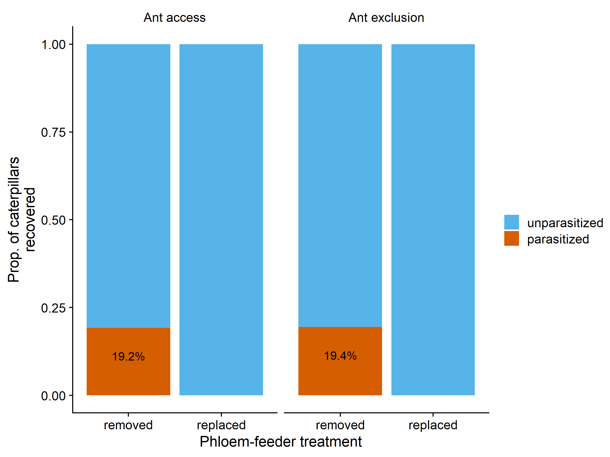

Phloem Feeding Insects Inhibit Caterpillar Parasitism
================
Riley M. Anderson
April 04, 2024

- [Overview](#overview)
- [Recovery Rates:](#recovery-rates)
- [Ants and Phloem-feeders:](#ants-and-phloem-feeders)
  - [GLMM approach](#glmm-approach)
- [Figure 2:](#figure-2)
  - [proportion recovered-all years](#proportion-recovered-all-years)
  - [counts all years](#counts-all-years)
  - [all years no ant effects](#all-years-no-ant-effects)
- [Supplemental table](#supplemental-table)
- [Volatiles](#volatiles)
  - [Volatile Plot](#volatile-plot)
- [Session Information](#session-information)

# Overview

# Recovery Rates:

| term                                       | estimate | std.error | statistic | p.value |
|:-------------------------------------------|---------:|----------:|----------:|--------:|
| (Intercept)                                |    0.154 |     0.396 |     0.389 |   0.703 |
| pf_treatmentreplaced                       |   -0.067 |     0.439 |    -0.152 |   0.881 |
| ant_treatmentexcluded                      |    0.597 |     0.561 |     1.065 |   0.304 |
| site1                                      |    0.628 |     0.725 |     0.866 |   0.400 |
| site2                                      |    0.247 |     0.509 |     0.485 |   0.635 |
| site3                                      |   -0.503 |     0.527 |    -0.954 |   0.355 |
| year1                                      |   -1.093 |     0.545 |    -2.005 |   0.063 |
| year2                                      |   -0.172 |     0.492 |    -0.349 |   0.732 |
| year3                                      |    0.885 |     0.471 |     1.879 |   0.080 |
| pf_treatmentreplaced:ant_treatmentexcluded |   -1.133 |     0.775 |    -1.463 |   0.164 |

# Ants and Phloem-feeders:

## GLMM approach

| LRT_models            |  Df |     AIC |     BIC |  logLik | deviance |  Chisq | Chi Df | Pr(\>Chisq) |
|:----------------------|----:|--------:|--------:|--------:|---------:|-------:|-------:|------------:|
| Null model            |   2 | 113.829 | 120.077 | -54.914 |  109.829 |     NA |     NA |          NA |
| Site                  |   5 | 114.381 | 130.001 | -52.191 |  104.381 |  5.448 |      3 |       0.142 |
| Year + Site           |   8 | 119.376 | 144.368 | -51.688 |  103.376 |  1.005 |      3 |       0.800 |
| Phloem-feeders        |   9 | 100.295 | 128.410 | -41.147 |   82.295 | 21.081 |      1 |       0.000 |
| Phloem-feeders + Ants |  10 | 101.268 | 132.508 | -40.634 |   81.268 |  1.027 |      1 |       0.311 |
| Phloem-feeders x Ants |  11 | 103.268 | 137.631 | -40.634 |   81.268 |  0.000 |      1 |       1.000 |

# Figure 2:

## proportion recovered-all years

<!-- -->

## counts all years

<!-- -->

## all years no ant effects

<!-- -->

<!-- -->

**Figure 2.** Caterpillar parasitism patterns across years (A) and sites
(B) by experimental phloem-feeder manipulation (removal in orange,
replacement in blue) and experimental ant treatment (ant access in
circles, ant exclusion in triangles). Each point is a single
caterpillar. Points are jittered for clarity. For detailed description
of sites, tree replicates, and caterpillar sample sizes, see table S1.

# Supplemental table

# Volatiles

## Volatile Plot

<!-- -->

# Session Information

    R version 4.2.3 (2023-03-15 ucrt)
    Platform: x86_64-w64-mingw32/x64 (64-bit)
    Running under: Windows 10 x64 (build 19045)

    Matrix products: default

    locale:
    [1] LC_COLLATE=English_United States.utf8 
    [2] LC_CTYPE=English_United States.utf8   
    [3] LC_MONETARY=English_United States.utf8
    [4] LC_NUMERIC=C                          
    [5] LC_TIME=English_United States.utf8    

    attached base packages:
    [1] stats     graphics  grDevices utils     datasets  methods   base     

    other attached packages:
     [1] ggpattern_1.0.1 car_3.1-2       carData_3.0-5   glmmTMB_1.1.8  
     [5] emmeans_1.8.5   knitr_1.42      lme4_1.1-32     Matrix_1.5-3   
     [9] cowplot_1.1.1   lubridate_1.9.2 forcats_1.0.0   stringr_1.5.0  
    [13] dplyr_1.1.1     purrr_1.0.1     readr_2.1.4     tidyr_1.3.0    
    [17] tibble_3.2.1    ggplot2_3.4.4   tidyverse_2.0.0

    loaded via a namespace (and not attached):
     [1] Rcpp_1.0.10         mvtnorm_1.1-3       lattice_0.20-45    
     [4] zoo_1.8-12          rprojroot_2.0.3     digest_0.6.31      
     [7] utf8_1.2.3          R6_2.5.1            evaluate_0.20      
    [10] coda_0.19-4         highr_0.10          pillar_1.9.0       
    [13] rlang_1.1.0         multcomp_1.4-25     rstudioapi_0.14    
    [16] minqa_1.2.5         nloptr_2.0.3        rmarkdown_2.21     
    [19] labeling_0.4.2      splines_4.2.3       TMB_1.9.9          
    [22] munsell_0.5.0       compiler_4.2.3      numDeriv_2016.8-1.1
    [25] xfun_0.38           pkgconfig_2.0.3     mgcv_1.8-42        
    [28] htmltools_0.5.5     tidyselect_1.2.0    codetools_0.2-19   
    [31] fansi_1.0.4         tzdb_0.3.0          withr_2.5.0        
    [34] MASS_7.3-58.2       grid_4.2.3          nlme_3.1-162       
    [37] xtable_1.8-4        gtable_0.3.3        lifecycle_1.0.3    
    [40] magrittr_2.0.3      scales_1.2.1        estimability_1.4.1 
    [43] cli_3.6.1           stringi_1.7.12      farver_2.1.1       
    [46] generics_0.1.3      vctrs_0.6.1         boot_1.3-28.1      
    [49] sandwich_3.0-2      TH.data_1.1-2       tools_4.2.3        
    [52] glue_1.6.2          hms_1.1.3           abind_1.4-5        
    [55] fastmap_1.1.1       survival_3.5-3      yaml_2.3.7         
    [58] timechange_0.2.0    colorspace_2.1-0   
