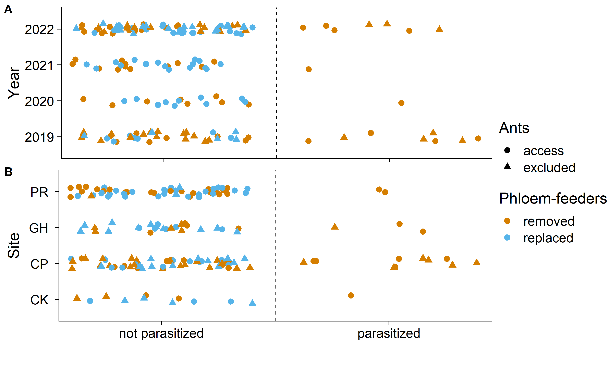

Phloem Feeding Insects Inhibit Caterpillar Parasitism
================
Riley M. Anderson & Robi Bagchi
May 15, 2024

- [Functions](#functions)
- [Overview](#overview)
  - [Branch level model for
    parasitism](#branch-level-model-for-parasitism)
  - [Figure 2](#figure-2)
    - [proportion recovered-all years](#proportion-recovered-all-years)
  - [Recovery rates of stocked
    caterpillars](#recovery-rates-of-stocked-caterpillars)
  - [Ants and Phloem-feeders:](#ants-and-phloem-feeders)
    - [counts all years](#counts-all-years)
    - [all years no ant effects](#all-years-no-ant-effects)
  - [Supplemental table](#supplemental-table)
  - [Volatiles](#volatiles)
    - [Volatile Plot](#volatile-plot)
  - [Session Information](#session-information)

``` r
# @@@@@@@@@@@@@@@@@@@@@@@@@@@@@@@@@@@@@@@@@@@@@@@@@@
# @@@@@ Data Preparation
# @@@@@@@@@@@@@@@@@@@@@@@@@@@@@@@@@@@@@@@@@@@@@@@@@@

## Import datasets:
# experiment data:
dat1 <- read.csv("data/data.19.20.21.22.csv")

# recovery rate data (caterpillars stocked):
rec.data <- read.csv("data/recovery.csv")

# volatile data:
chem <- read.csv("data/Mike_Trees_herbivores2.csv")
```

#################################################### 

# Functions

#################################################### 

``` r
# Function to scale the range of values so that they are always positive or always negative, respectively:

range01 <- function(x){
  (x-min(x, na.rm = TRUE))/(max(x, na.rm = TRUE)-min(x, na.rm = TRUE))
  }


# Function to check for overdispersion in poisson and binomial models:

overdispersion_test <- function(model, type = "pearson"){
    
    # Get the pearson residuals
    residuals <- resid(model, type = type)
    
    # Get the residual degrees of freedom of the model
    df <- df.residual(model)
    
    # Sum of residual deviance
    dev <- sum(residuals ^ 2)
    
    # Overdispersion = sum of squared residuals / residual degrees of freedom
    ratio <- round(dev / df, 3)
    
    # P-value 
    pvalue <- round(pchisq(dev, df, lower.tail = FALSE), 3)
    
    # Get the formula
    f = paste(as.character(formula(model))[2:3], collapse = " ~ ")
    
    # Get the model name
    name <- deparse(substitute(model))
    cat("Overdispersion ratio for model:", name, "\nformula:", f, 
        "\n\nAcceptable range: 1 - 1.4\nOverdispersion ratio:",
        ratio, " df:", df, " p =", pvalue, "\n", 
        ifelse(pvalue < 0.05, "Data are overdispersed\n", 
        "Data are not overdispersed\n"))
    
    # Return all the parameters
    return(c(ratio = ratio, deviance = dev, df = df, pvalue = pvalue))
    
}

# Function to generate ellipses dataset:

veganCovEllipse<-function (cov, center = c(0, 0), scale = 1, npoints = 100) 
{
  theta <- (0:npoints) * 2 * pi/npoints
  Circle <- cbind(cos(theta), sin(theta))
  t(center + scale * t(Circle %*% chol(cov)))
}

###########
# Seed
set.seed(321)
```

# Overview

## Branch level model for parasitism

``` r
n_distinct(dat1$branchID); n_distinct(dat1$year); n_distinct(dat1$site);
## [1] 93
## [1] 4
## [1] 4
n_distinct(dat1$cat_species) ## Enough replication for branch and cat_sp to be
## [1] 28
# random. year and site need to be fixed.

branch_tmbmod <- glmmTMB(para ~ pf_treatment * ant_treatment +
                    year + site + (1|branchID) + (1|cat_species), 
                    family = binomial, data = dat1,
                    contrasts=list(year = "contr.sum", site = "contr.sum"))
summary(branch_tmbmod) ## Hauck-Donner effect due to complete separation.
##  Family: binomial  ( logit )
## Formula:          
## para ~ pf_treatment * ant_treatment + year + site + (1 | branchID) +  
##     (1 | cat_species)
## Data: dat1
## 
##      AIC      BIC   logLik deviance df.resid 
##    105.3    142.8    -40.6     81.3      156 
## 
## Random effects:
## 
## Conditional model:
##  Groups      Name        Variance  Std.Dev. 
##  branchID    (Intercept) 1.284e-09 3.583e-05
##  cat_species (Intercept) 7.687e-02 2.773e-01
## Number of obs: 168, groups:  branchID, 93; cat_species, 28
## 
## Conditional model:
##                                              Estimate Std. Error z value
## (Intercept)                                   -1.2376     0.6156  -2.010
## pf_treatmentreplaced                         -21.6179 14357.9480  -0.002
## ant_treatmentexcluded                         -0.6315     0.6330  -0.998
## year1                                          0.1971     0.9096   0.217
## year2                                          0.3474     1.1641   0.298
## year3                                         -0.4936     0.9758  -0.506
## site1                                          0.2467     1.0360   0.238
## site2                                          0.3720     0.7065   0.527
## site3                                          0.5563     0.6898   0.806
## pf_treatmentreplaced:ant_treatmentexcluded    -2.8872 83441.5718   0.000
##                                            Pr(>|z|)  
## (Intercept)                                  0.0444 *
## pf_treatmentreplaced                         0.9988  
## ant_treatmentexcluded                        0.3185  
## year1                                        0.8285  
## year2                                        0.7654  
## year3                                        0.6130  
## site1                                        0.8118  
## site2                                        0.5985  
## site3                                        0.4199  
## pf_treatmentreplaced:ant_treatmentexcluded   1.0000  
## ---
## Signif. codes:  0 '***' 0.001 '**' 0.01 '*' 0.05 '.' 0.1 ' ' 1

## Using a parametric bootstrap to get around the problem
branch_tmbsims <- simulate(branch_tmbmod, 999)

## set up cluster for parallel computation
cl <- makeCluster(detectCores()-1)
clusterExport(cl, list("branch_tmbmod", "dat1"))
clusterEvalQ(cl, library(glmmTMB))
## [[1]]
## [1] "glmmTMB"   "stats"     "graphics"  "grDevices" "utils"     "datasets" 
## [7] "methods"   "base"     
## 
## [[2]]
## [1] "glmmTMB"   "stats"     "graphics"  "grDevices" "utils"     "datasets" 
## [7] "methods"   "base"     
## 
## [[3]]
## [1] "glmmTMB"   "stats"     "graphics"  "grDevices" "utils"     "datasets" 
## [7] "methods"   "base"     
## 
## [[4]]
## [1] "glmmTMB"   "stats"     "graphics"  "grDevices" "utils"     "datasets" 
## [7] "methods"   "base"     
## 
## [[5]]
## [1] "glmmTMB"   "stats"     "graphics"  "grDevices" "utils"     "datasets" 
## [7] "methods"   "base"     
## 
## [[6]]
## [1] "glmmTMB"   "stats"     "graphics"  "grDevices" "utils"     "datasets" 
## [7] "methods"   "base"     
## 
## [[7]]
## [1] "glmmTMB"   "stats"     "graphics"  "grDevices" "utils"     "datasets" 
## [7] "methods"   "base"     
## 
## [[8]]
## [1] "glmmTMB"   "stats"     "graphics"  "grDevices" "utils"     "datasets" 
## [7] "methods"   "base"     
## 
## [[9]]
## [1] "glmmTMB"   "stats"     "graphics"  "grDevices" "utils"     "datasets" 
## [7] "methods"   "base"     
## 
## [[10]]
## [1] "glmmTMB"   "stats"     "graphics"  "grDevices" "utils"     "datasets" 
## [7] "methods"   "base"     
## 
## [[11]]
## [1] "glmmTMB"   "stats"     "graphics"  "grDevices" "utils"     "datasets" 
## [7] "methods"   "base"     
## 
## [[12]]
## [1] "glmmTMB"   "stats"     "graphics"  "grDevices" "utils"     "datasets" 
## [7] "methods"   "base"     
## 
## [[13]]
## [1] "glmmTMB"   "stats"     "graphics"  "grDevices" "utils"     "datasets" 
## [7] "methods"   "base"     
## 
## [[14]]
## [1] "glmmTMB"   "stats"     "graphics"  "grDevices" "utils"     "datasets" 
## [7] "methods"   "base"     
## 
## [[15]]
## [1] "glmmTMB"   "stats"     "graphics"  "grDevices" "utils"     "datasets" 
## [7] "methods"   "base"
branch_tmbboot <- parSapplyLB(cl, branch_tmbsims, function(d){
  simmod <- refit(branch_tmbmod, newresp=d[,1])
  return(simmod)}, simplify=FALSE)

stopCluster(cl)

branch_tmbcis <- cbind(Est = fixef(branch_tmbmod)$cond,
                       mean_est = apply(sapply(branch_tmbboot, 
                                    function(m) fixef(m)$cond), 1, mean),
                       t(apply(sapply(branch_tmbboot, 
                                      function(m) fixef(m)$cond), 1,
                       quantile, c(0.025, 0.975))))
                       
kable(branch_tmbcis)
```

|                                            |         Est |    mean_est |       2.5% |       97.5% |
|:-------------------------------------------|------------:|------------:|-----------:|------------:|
| (Intercept)                                |  -1.2376355 |  -7.7976000 | -24.014936 |  -0.0689839 |
| pf_treatmentreplaced                       | -21.6178980 | -26.7651914 | -46.981835 | -17.4441690 |
| ant_treatmentexcluded                      |  -0.6315112 |  -0.8064234 |  -2.217989 |   0.6812016 |
| year1                                      |   0.1970723 |   2.3787454 | -15.875004 |  20.9890699 |
| year2                                      |   0.3474126 |   2.1227570 | -22.550711 |  28.9419040 |
| year3                                      |  -0.4936173 |  -5.5897228 | -31.303670 |  14.0752133 |
| site1                                      |   0.2466638 |  -2.6806694 | -24.557099 |  14.6687823 |
| site2                                      |   0.3720153 |   4.4207692 | -11.307061 |  20.0404304 |
| site3                                      |   0.5563021 |   4.0549133 | -12.721603 |  17.1071588 |
| pf_treatmentreplaced:ant_treatmentexcluded |  -2.8871892 |  -2.3993729 |  -9.300318 |   3.4759451 |

``` r

## analysis of deviance
## remove interaction
branch_tmbmod_main <- update(branch_tmbmod, ~.-ant_treatment:pf_treatment)
# test main effects (always against model with all main effects, so type 2 SS)
branch_tmbmod_pf <- update(branch_tmbmod_main, ~.-pf_treatment)
branch_tmbmod_ant <- glmmTMB(para ~ pf_treatment +
                               year + site +
                               (1|branchID) + (1|cat_species), 
                    family = binomial, data = dat1,
                    contrasts=list(site = "contr.sum"))
## update doesn't work with glmmTMB and multilevel factors
branch_tmbmod_y <- glmmTMB(para ~ pf_treatment + ant_treatment +
                    site + (1|branchID) + (1|cat_species), 
                    family = binomial, data = dat1,
                    contrasts=list(site = "contr.sum"))
branch_tmbmod_s <- glmmTMB(para ~ pf_treatment + ant_treatment +
                             year +  (1|branchID) + (1|cat_species), 
                           family = binomial, data = dat1,
                            contrasts=list(year = "contr.sum"),
                           se = FALSE) 
### this model doesn't converge due to Hessian computation issues. But for a 
### andev we don't need the SEs, so not computing here to allow some convergence

AIC(branch_tmbmod, branch_tmbmod_main, 
                    branch_tmbmod_pf, branch_tmbmod_ant,
                    branch_tmbmod_y, branch_tmbmod_s)
##                    df       AIC
## branch_tmbmod      12 105.26787
## branch_tmbmod_main 11 103.26787
## branch_tmbmod_pf   10 122.60573
## branch_tmbmod_ant  10 102.29463
## branch_tmbmod_y     8  97.65110
## branch_tmbmod_s     8  99.15821

## dropping pf clearly increases AIC (by 19 units from main effect model).
## make analysis of deviance table (a bit tedious)
andev <- function(m0, m1){
  tab <- as.data.frame(anova(m0, m1))
  tab <- cbind(t(apply(tab[,2:5], 2, diff)), tab[2, 6:8] )
  tab[,4] <- tab[,4]*(-1)
  return(tab)}

andev_tab <- rbind(
  "Site" = andev(branch_tmbmod_s, branch_tmbmod_main),
  "Year" = andev(branch_tmbmod_y, branch_tmbmod_main),
  "Phloem-feeders" = andev(branch_tmbmod_pf, branch_tmbmod_main),
  "Ants" = andev(branch_tmbmod_ant, branch_tmbmod_main),
  "Phloem-feeders x Ants" = andev(branch_tmbmod, branch_tmbmod_main))

kable(andev_tab, format = "markdown", digits = 3)
```

|                       |     AIC |     BIC | logLik | deviance |  Chisq | Chi Df | Pr(\>Chisq) |
|:----------------------|--------:|--------:|-------:|---------:|-------:|-------:|------------:|
| Site                  |   4.110 |  13.482 |  0.945 |    1.890 |  1.890 |      3 |       0.595 |
| Year                  |   5.617 |  14.989 |  0.192 |    0.383 |  0.383 |      3 |       0.944 |
| Phloem-feeders        | -19.338 | -16.214 | 10.669 |   21.338 | 21.338 |      1 |       0.000 |
| Ants                  |   0.973 |   4.097 |  0.513 |    1.027 |  1.027 |      1 |       0.311 |
| Phloem-feeders x Ants |   2.000 |   5.124 |  0.000 |    0.000 |  0.000 |      1 |       1.000 |

## Figure 2

### proportion recovered-all years

<!-- -->

## Recovery rates of stocked caterpillars

| term                                       | estimate | std.error | statistic | p.value |
|:-------------------------------------------|---------:|----------:|----------:|--------:|
| (Intercept)                                |    0.154 |     0.396 |     0.389 |   0.703 |
| pf_treatmentreplaced                       |   -0.067 |     0.439 |    -0.152 |   0.881 |
| ant_treatmentexcluded                      |    0.597 |     0.561 |     1.065 |   0.304 |
| site1                                      |    0.628 |     0.725 |     0.866 |   0.400 |
| site2                                      |    0.247 |     0.509 |     0.485 |   0.635 |
| site3                                      |   -0.503 |     0.527 |    -0.954 |   0.355 |
| year1                                      |   -1.093 |     0.545 |    -2.005 |   0.063 |
| year2                                      |   -0.172 |     0.492 |    -0.349 |   0.732 |
| year3                                      |    0.885 |     0.471 |     1.879 |   0.080 |
| pf_treatmentreplaced:ant_treatmentexcluded |   -1.133 |     0.775 |    -1.463 |   0.164 |

## Ants and Phloem-feeders:

### counts all years

<!-- -->

### all years no ant effects

<!-- -->

<!-- -->

**Figure 2.** Caterpillar parasitism patterns across years (A) and sites
(B) by experimental phloem-feeder manipulation (removal in orange,
replacement in blue) and experimental ant treatment (ant access in
circles, ant exclusion in triangles). Each point is a single
caterpillar. Points are jittered for clarity. For detailed description
of sites, tree replicates, and caterpillar sample sizes, see table S1.

## Supplemental table

## Volatiles

### Volatile Plot

<!-- -->

``` r
chem$block <- rep(1:8, each = 2)
chem <- rename(chem, "pf_treatment" = "treatment.1",
               "pf_species" = "ploem.feeder")
names(chem)
##  [1] "treatment"    "rep"          "pf_treatment" "pf_species"   "C4"          
##  [6] "C5"           "C90"          "C91"          "C93"          "C9"          
## [11] "C94"          "C18"          "C95"          "C21"          "C22"         
## [16] "C31"          "C32"          "C97"          "C98"          "C99"         
## [21] "C43"          "C102"         "C103"         "C106"         "C108"        
## [26] "C74"          "C75"          "C78"          "C79"          "C80"         
## [31] "C81"          "C82"          "C83"          "C84"          "C86"         
## [36] "C87"          "C89"          "block"
vmod <- adonis2(chem[, 5:37] ~ pf_treatment * pf_species, 
                strata = chem$block, 
                data = chem, permutations=999)

vmod_m <- adonis2(chem[, 5:37] ~ pf_treatment + pf_species, 
                strata = chem$block, 
                data = chem, permutations=999)


print(vmod) ## both  pf_treatment and pf_species now have significant
## Permutation test for adonis under reduced model
## Terms added sequentially (first to last)
## Blocks:  strata 
## Permutation: free
## Number of permutations: 255
## 
## adonis2(formula = chem[, 5:37] ~ pf_treatment * pf_species, data = chem, permutations = 999, strata = chem$block)
##                         Df SumOfSqs      R2      F  Pr(>F)  
## pf_treatment             1  0.26862 0.14699 2.5292 0.03125 *
## pf_species               1  0.23300 0.12750 2.1938 0.18750  
## pf_treatment:pf_species  1  0.05136 0.02810 0.4836 0.72656  
## Residual                12  1.27450 0.69741                 
## Total                   15  1.82748 1.00000                 
## ---
## Signif. codes:  0 '***' 0.001 '**' 0.01 '*' 0.05 '.' 0.1 ' ' 1
## effects on voc composition.

library(randomForest)
rfmod_pf <- randomForest(y = as.factor(chem$pf_treatment), 
                      x = select(chem, starts_with("C")), 
                      strata = chem$block, importance = TRUE, nPerm = 999)
varImpPlot(rfmod_pf)
```

<!-- -->

``` r
imp_vals_pf <- data.frame(importance(rfmod_pf))
imp_vals_pf <- imp_vals_pf |> arrange(desc(MeanDecreaseGini))
## find values with within the top 10% of importance values
imp_vals_toppf <- filter(imp_vals_pf,
                         MeanDecreaseGini > quantile(MeanDecreaseGini, 0.9)) 
imp_vals_toppf
##      removed replaced MeanDecreaseAccuracy MeanDecreaseGini
## C83 5.591947 5.245353             6.196672        0.9311396
## C32 4.843608 5.341929             5.701511        0.7449624
## C80 3.826946 2.626473             4.202697        0.6531383
## C4  1.732092 2.178387             2.218284        0.5677520

## differences between taxa
rfmod_sp <- randomForest(y = as.factor(chem$pf_species), 
                      x = select(chem, starts_with("C")), 
                      strata = chem$block, importance = TRUE, nPerm = 500)
varImpPlot(rfmod_sp)
```

<!-- -->

``` r
imp_vals_sp <- data.frame(importance(rfmod_sp))
imp_vals_sp <- imp_vals_sp |> arrange(desc(MeanDecreaseGini))
## find values with within the top 10% of importance values
imp_vals_topsp <- filter(imp_vals_sp,
                         MeanDecreaseGini > quantile(MeanDecreaseGini, 0.9)) 
pf_sp_comp <- cbind(imp_vals_sp, imp_vals_pf[rownames(imp_vals_sp),])
names(pf_sp_comp)[c(4, 8)] <- c("gini_sp", "gini_pf")
cor(pf_sp_comp[,c("gini_sp", "gini_pf")]) ## low correlation.
##           gini_sp   gini_pf
## gini_sp 1.0000000 0.2875914
## gini_pf 0.2875914 1.0000000

chem_imp <- select(chem, pf_treatment, pf_species, block, 
                  rownames(imp_vals_toppf), rownames(imp_vals_topsp))

pf_aovs <- sapply(rownames(imp_vals_toppf), function(voc){
  # form <- paste(voc, "~  pf_treatment * pf_species + (1|block)")
  # mod <- lmerTest::lmer(as.formula(form), data = chem_imp)
  form <- paste(voc, "~  pf_treatment * pf_species + Error(block)") 
  mod <- aov(as.formula(form), data= chem_imp)
}, simplify = FALSE)


sp_aovs <- sapply(rownames(imp_vals_topsp), function(voc){
  #form <- paste(voc, "~  pf_treatment * pf_species + (1|block)") 
  #mod <- lmerTest::lmer(as.formula(form), data = chem_imp)
  form <- paste(voc, "~  pf_treatment * pf_species + Error(block)") 
  mod <- aov(as.formula(form), data= chem_imp)
}, simplify = FALSE)

lapply(pf_aovs, function(m) kable((summary(m)[[2]][[1]])))
## $C83
## 
## 
## |                        | Df|    Sum Sq|   Mean Sq|   F value|    Pr(>F)|
## |:-----------------------|--:|---------:|---------:|---------:|---------:|
## |pf_treatment            |  1| 0.0300568| 0.0300568| 9.5051411| 0.0104146|
## |pf_species              |  1| 0.0022488| 0.0022488| 0.7111528| 0.4170223|
## |pf_treatment:pf_species |  1| 0.0029423| 0.0029423| 0.9304691| 0.3554688|
## |Residuals               | 11| 0.0347838| 0.0031622|        NA|        NA|
## 
## $C32
## 
## 
## |                        | Df|    Sum Sq|   Mean Sq|  F value|    Pr(>F)|
## |:-----------------------|--:|---------:|---------:|--------:|---------:|
## |pf_treatment            |  1| 0.0450122| 0.0450122| 8.115941| 0.0158293|
## |pf_species              |  1| 0.0132926| 0.0132926| 2.396725| 0.1498622|
## |pf_treatment:pf_species |  1| 0.0318151| 0.0318151| 5.736419| 0.0355405|
## |Residuals               | 11| 0.0610077| 0.0055462|       NA|        NA|
## 
## $C80
## 
## 
## |                        | Df|    Sum Sq|   Mean Sq|   F value|    Pr(>F)|
## |:-----------------------|--:|---------:|---------:|---------:|---------:|
## |pf_treatment            |  1| 0.0307364| 0.0307364| 6.1256440| 0.0308462|
## |pf_species              |  1| 0.0015434| 0.0015434| 0.3076035| 0.5902530|
## |pf_treatment:pf_species |  1| 0.0130204| 0.0130204| 2.5949251| 0.1355045|
## |Residuals               | 11| 0.0551942| 0.0050177|        NA|        NA|
## 
## $C4
## 
## 
## |                        | Df|    Sum Sq|   Mean Sq|   F value|    Pr(>F)|
## |:-----------------------|--:|---------:|---------:|---------:|---------:|
## |pf_treatment            |  1| 1.0491499| 1.0491499| 8.3314769| 0.0148001|
## |pf_species              |  1| 0.0192296| 0.0192296| 0.1527054| 0.7034254|
## |pf_treatment:pf_species |  1| 0.2104090| 0.2104090| 1.6708937| 0.2226307|
## |Residuals               | 11| 1.3851865| 0.1259260|        NA|        NA|
lapply(sp_aovs, function(m) kable(summary(m)[[2]][[1]]))
## $C82
## 
## 
## |                        | Df|    Sum Sq|   Mean Sq|   F value|    Pr(>F)|
## |:-----------------------|--:|---------:|---------:|---------:|---------:|
## |pf_treatment            |  1| 0.0037723| 0.0037723| 1.6486111| 0.2255335|
## |pf_species              |  1| 0.0001337| 0.0001337| 0.0584296| 0.8134425|
## |pf_treatment:pf_species |  1| 0.0044708| 0.0044708| 1.9538626| 0.1897211|
## |Residuals               | 11| 0.0251701| 0.0022882|        NA|        NA|
## 
## $C90
## 
## 
## |                        | Df|    Sum Sq|   Mean Sq|   F value|    Pr(>F)|
## |:-----------------------|--:|---------:|---------:|---------:|---------:|
## |pf_treatment            |  1| 0.0079083| 0.0079083| 3.1289976| 0.1045934|
## |pf_species              |  1| 0.0010581| 0.0010581| 0.4186346| 0.5308890|
## |pf_treatment:pf_species |  1| 0.0000502| 0.0000502| 0.0198529| 0.8904958|
## |Residuals               | 11| 0.0278017| 0.0025274|        NA|        NA|
## 
## $C5
## 
## 
## |                        | Df|    Sum Sq|   Mean Sq|   F value|    Pr(>F)|
## |:-----------------------|--:|---------:|---------:|---------:|---------:|
## |pf_treatment            |  1| 0.0309822| 0.0309822| 3.0252917| 0.1098431|
## |pf_species              |  1| 0.0083214| 0.0083214| 0.8125519| 0.3866781|
## |pf_treatment:pf_species |  1| 0.0139241| 0.0139241| 1.3596317| 0.2682610|
## |Residuals               | 11| 0.1126516| 0.0102411|        NA|        NA|
## 
## $C74
## 
## 
## |                        | Df|    Sum Sq|   Mean Sq|   F value|    Pr(>F)|
## |:-----------------------|--:|---------:|---------:|---------:|---------:|
## |pf_treatment            |  1| 0.0390097| 0.0390097| 0.3172532| 0.5845615|
## |pf_species              |  1| 0.2886340| 0.2886340| 2.3473681| 0.1537351|
## |pf_treatment:pf_species |  1| 0.0352125| 0.0352125| 0.2863718| 0.6032050|
## |Residuals               | 11| 1.3525673| 0.1229607|        NA|        NA|

## if using lme4 version, but aov is simpler.
## singularities due to 0 variance among blocks.
## Not  a big issue 
# sapply(pf_aovs, function(m) VarCorr(m)$block)
# sapply(sp_aovs, function(m) VarCorr(m)$block)
# 
# sapply(pf_aovs, function(m) kable(anova(m, type =2)))
# sapply(sp_aovs, function(m) kable(anova(m, type =2)))
```

## Session Information

    R version 4.2.3 (2023-03-15 ucrt)
    Platform: x86_64-w64-mingw32/x64 (64-bit)
    Running under: Windows 10 x64 (build 19045)

    Matrix products: default

    locale:
    [1] LC_COLLATE=English_United States.utf8 
    [2] LC_CTYPE=English_United States.utf8   
    [3] LC_MONETARY=English_United States.utf8
    [4] LC_NUMERIC=C                          
    [5] LC_TIME=English_United States.utf8    

    attached base packages:
    [1] stats     graphics  grDevices utils     datasets  methods   base     

    other attached packages:
     [1] ggpattern_1.0.1 car_3.1-2       carData_3.0-5   glmmTMB_1.1.8  
     [5] emmeans_1.8.5   knitr_1.42      lme4_1.1-32     Matrix_1.5-3   
     [9] cowplot_1.1.1   lubridate_1.9.2 forcats_1.0.0   stringr_1.5.0  
    [13] dplyr_1.1.1     purrr_1.0.1     readr_2.1.4     tidyr_1.3.0    
    [17] tibble_3.2.1    ggplot2_3.4.4   tidyverse_2.0.0

    loaded via a namespace (and not attached):
     [1] Rcpp_1.0.10         mvtnorm_1.1-3       lattice_0.20-45    
     [4] zoo_1.8-12          rprojroot_2.0.3     digest_0.6.31      
     [7] utf8_1.2.3          R6_2.5.1            evaluate_0.20      
    [10] coda_0.19-4         highr_0.10          pillar_1.9.0       
    [13] rlang_1.1.0         multcomp_1.4-25     rstudioapi_0.14    
    [16] minqa_1.2.5         nloptr_2.0.3        rmarkdown_2.21     
    [19] labeling_0.4.2      splines_4.2.3       TMB_1.9.9          
    [22] munsell_0.5.0       compiler_4.2.3      numDeriv_2016.8-1.1
    [25] xfun_0.38           pkgconfig_2.0.3     mgcv_1.8-42        
    [28] htmltools_0.5.5     tidyselect_1.2.0    codetools_0.2-19   
    [31] fansi_1.0.4         tzdb_0.3.0          withr_2.5.0        
    [34] MASS_7.3-58.2       grid_4.2.3          nlme_3.1-162       
    [37] xtable_1.8-4        gtable_0.3.3        lifecycle_1.0.3    
    [40] magrittr_2.0.3      scales_1.2.1        estimability_1.4.1 
    [43] cli_3.6.1           stringi_1.7.12      farver_2.1.1       
    [46] generics_0.1.3      vctrs_0.6.1         boot_1.3-28.1      
    [49] sandwich_3.0-2      TH.data_1.1-2       tools_4.2.3        
    [52] glue_1.6.2          hms_1.1.3           abind_1.4-5        
    [55] fastmap_1.1.1       survival_3.5-3      yaml_2.3.7         
    [58] timechange_0.2.0    colorspace_2.1-0   
