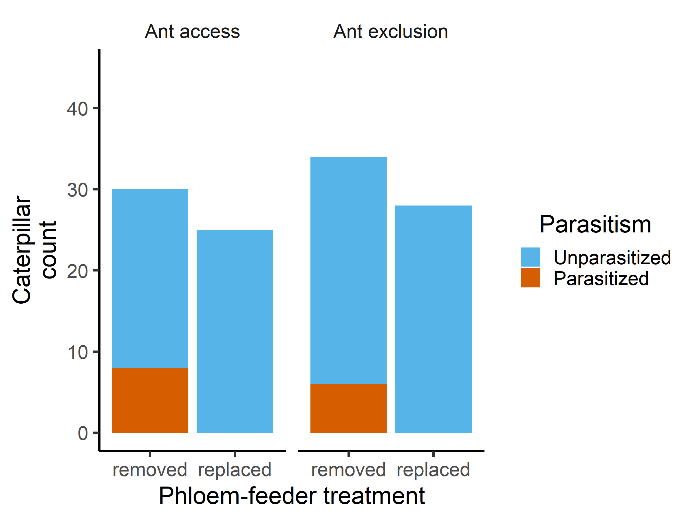

Phloem Feeding Insects Inhibit Caterpillar Parasitism
================
Riley M. Anderson
October 04, 2023

- <a href="#overview" id="toc-overview">Overview</a>
  - <a href="#summary-of-results" id="toc-summary-of-results">Summary of
    Results</a>
- <a href="#natural-membracid-density-in-2022-membracidsm2"
  id="toc-natural-membracid-density-in-2022-membracidsm2">Natural
  membracid density in 2022 (membracids/m2)</a>
- <a href="#ants" id="toc-ants">Ants:</a>
  - <a href="#2019--2022-comparison-of-ant-treatments-on-parasitism"
    id="toc-2019--2022-comparison-of-ant-treatments-on-parasitism">2019
    &amp; 2022 comparison of ant treatments on parasitism</a>
  - <a href="#ant-figure" id="toc-ant-figure">Ant figure</a>
  - <a
    href="#logistic-model-of-the-factorial-ant--pf-treatments-on-parasitism"
    id="toc-logistic-model-of-the-factorial-ant--pf-treatments-on-parasitism">Logistic
    model of the factorial ant &amp; pf treatments on parasitism</a>
  - <a href="#ant--pf-means-and-cis-figure"
    id="toc-ant--pf-means-and-cis-figure">Ant &amp; PF means and CIs
    figure</a>
- <a href="#phloem-feeders" id="toc-phloem-feeders">Phloem-feeders:</a>
  - <a
    href="#2019-2022-parasitism-analysis-of-phloem-feeders-via-fishers-exact-test"
    id="toc-2019-2022-parasitism-analysis-of-phloem-feeders-via-fishers-exact-test">2019-2022
    parasitism analysis of phloem-feeders via Fisher’s Exact Test</a>
  - <a
    href="#2019-2022-parasitism-analysis-of-phloem-feeders-via-binomial-glm"
    id="toc-2019-2022-parasitism-analysis-of-phloem-feeders-via-binomial-glm">2019-2022
    parasitism analysis of phloem-feeders via binomial GLM</a>
  - <a href="#phloem-feeder-figure"
    id="toc-phloem-feeder-figure">Phloem-feeder figure</a>
  - <a href="#parasitism-by-caterpillar-species-and-pf-treatment-figure"
    id="toc-parasitism-by-caterpillar-species-and-pf-treatment-figure">Parasitism
    by caterpillar species and PF treatment figure</a>
- <a href="#session-information" id="toc-session-information">Session
  Information</a>

# Overview

This analysis tests two hypotheses on the putative keystone effects of
phloem-feeding insects. One keystone effect is the influence that
phloem-feeders have on caterpillar-parasitoid interactions. These
interactions may be mediated through ants (via symbiosis that attracts
ants which can deter parasitoids) or plants (via phytohormonal
crosstalk). The basic experimental design manipulates phloem-feeder
presence by removing phloem-feeders or by removing and then replacing
them. This experiment was carried out over 4 years, two of which were
paired with an experimental ant manipulation (ants were excluded or ants
had access). See *Anderson et al. \_\_\_\_\_\_\_* for details.

The statistical approach uses Fisher tests wherever possible for
simplicity. However, we also employ the use of logistic regression
models to analyze the factorial design in the ant experiment and to
estimate predicted means and 95% confidence intervals. These statistics
are estimated from parametric bootstraps of 1000 simulations from the
posterior distributions of the binomial GLMs.

### Summary of Results

- Across four years, we experimentally manipulated 122 branches on white
  oak (*Quercus alba*) trees.

- In 2019 and 2022 we implemented a factorial ant and phloem-feeder
  exclusion experiment. These experiments show that ants had no effect
  on parasitism. The distribution of parasitized caterpillars was
  essentially random across ant treatments (Fisher’s exact test: *P* =
  0.570, two-tailed test). Logistic regression of the two-way
  interaction confirms that the parasitism effect is independent of ant
  treatment.

- Across all four years, caterpillars were never parasitized in the
  presence of phloem-feeding insects (Fisher’s exact test: *P* \< 0.001,
  two tailed test).

<!-- -->

    Analysis of Variance Table

    Response: mem.density
              Df Sum Sq Mean Sq F value   Pr(>F)   
    Site       3 15.446  5.1485  6.1638 0.002621 **
    Residuals 26 21.718  0.8353                    
    ---
    Signif. codes:  0 '***' 0.001 '**' 0.01 '*' 0.05 '.' 0.1 ' ' 1

    Call:
    lm(formula = mem.density ~ Site, data = pf.dens)

    Residuals:
        Min      1Q  Median      3Q     Max 
    -2.7266 -0.4274 -0.1613  0.2808  2.5188 

    Coefficients:
                                      Estimate Std. Error t value Pr(>|t|)    
    (Intercept)                         1.0695     0.3231   3.310 0.002740 ** 
    SiteKelseytown Rd Cockaponset       2.2941     0.6187   3.708 0.000997 ***
    SiteMeshomasic Kongcut Mtn         -0.2010     0.4172  -0.482 0.633994    
    SitePortland Reservoir Meshomasic   0.1062     0.4730   0.225 0.824091    
    ---
    Signif. codes:  0 '***' 0.001 '**' 0.01 '*' 0.05 '.' 0.1 ' ' 1

    Residual standard error: 0.9139 on 26 degrees of freedom
    Multiple R-squared:  0.4156,    Adjusted R-squared:  0.3482 
    F-statistic: 6.164 on 3 and 26 DF,  p-value: 0.002621

# Natural membracid density in 2022 (membracids/m2)

| Site                          |  mean |    sd |
|:------------------------------|------:|------:|
| Cockaponset pit               | 1.070 | 0.685 |
| Kelseytown Rd Cockaponset     | 3.364 | 2.629 |
| Meshomasic Kongcut Mtn        | 0.869 | 0.454 |
| Portland Reservoir Meshomasic | 1.176 | 0.625 |
| Overall                       | 1.243 | 1.132 |

# Ants:

## 2019 & 2022 comparison of ant treatments on parasitism

|               |  no | yes |
|:--------------|----:|----:|
| Ant access    |  47 |   8 |
| Ant exclusion |  56 |   6 |

    ## 
    ##  Fisher's Exact Test for Count Data
    ## 
    ## data:  ant.19.22.matrix
    ## p-value = 0.5698
    ## alternative hypothesis: true odds ratio is not equal to 1
    ## 95 percent confidence interval:
    ##  0.1678645 2.2461619
    ## sample estimates:
    ## odds ratio 
    ##   0.631979

## Ant figure

<!-- -->

- Figure 1. Parasitism rate of caterpillars as a function of the
  factorial combinations of the phloem-feeder and ant treatments in
  Experiment 1.

## Logistic model of the factorial ant & pf treatments on parasitism

    ## 
    ## Call:  glm(formula = para ~ mem.treat * ant.treat, family = binomial(), 
    ##     data = ant.data)
    ## 
    ## Coefficients:
    ##                         (Intercept)                    mem.treatreplaced  
    ##                             -1.0116                             -18.5545  
    ##                   ant.treatexcluded  mem.treatreplaced:ant.treatexcluded  
    ##                             -0.5288                               0.5288  
    ## 
    ## Degrees of Freedom: 116 Total (i.e. Null);  113 Residual
    ## Null Deviance:       85.7 
    ## Residual Deviance: 66.48     AIC: 74.48

- Analysis of deviance results:

|                     | LR Chisq |  Df | Pr(\>Chisq) |
|:--------------------|---------:|----:|------------:|
| mem.treat           |  18.5630 |   1 |      0.0000 |
| ant.treat           |   0.7583 |   1 |      0.3839 |
| mem.treat:ant.treat |   0.0000 |   1 |      1.0000 |

## Ant & PF means and CIs figure

This figure is a visual representation of the logistic model approach
(as opposed to Fisher’s test). Here, we model the probability of
parasitism as a function of ant treatment, phloem-feeder treatment, and
their two-way interaction. Points and whiskers are means and 95%
confidence intervals estimated from a parametric bootstrap from 1000
simulations of the posterior distribution of the binomial GLM.

    ## 
    ## Call:  glm(formula = para ~ mem.treat * ant.treat, family = binomial(), 
    ##     data = ant.data)
    ## 
    ## Coefficients:
    ##                         (Intercept)                    mem.treatreplaced  
    ##                             -1.0116                             -18.5545  
    ##                   ant.treatexcluded  mem.treatreplaced:ant.treatexcluded  
    ##                             -0.5288                               0.5288  
    ## 
    ## Degrees of Freedom: 116 Total (i.e. Null);  113 Residual
    ## Null Deviance:       85.7 
    ## Residual Deviance: 66.48     AIC: 74.48

<!-- -->

- Caterpillars were only ever parasitized in the absence of
  phloem-feeders, and this effect was independent of ants.

# Phloem-feeders:

## 2019-2022 parasitism analysis of phloem-feeders via Fisher’s Exact Test

| treatment |  no | yes |
|:----------|----:|----:|
| removed   |  76 |  15 |
| replaced  |  82 |   0 |

    ## 
    ##  Fisher's Exact Test for Count Data
    ## 
    ## data:  totals[, 2:3]
    ## p-value = 4.253e-05
    ## alternative hypothesis: true odds ratio is not equal to 1
    ## 95 percent confidence interval:
    ##  0.0000000 0.2718111
    ## sample estimates:
    ## odds ratio 
    ##          0

## 2019-2022 parasitism analysis of phloem-feeders via binomial GLM

    ## Analysis of Deviance Table (Type II tests)
    ## 
    ## Response: yes/(yes + no)
    ##           LR Chisq Df Pr(>Chisq)    
    ## treatment   20.554  1  5.798e-06 ***
    ## ---
    ## Signif. codes:  0 '***' 0.001 '**' 0.01 '*' 0.05 '.' 0.1 ' ' 1
    ##   treatment no yes
    ## 1   removed  2   0
    ## 2  replaced  2   0
    ## 3   removed  1   0
    ## 4  replaced  1   0
    ## 5   removed  2   1
    ## 6   removed  2   0

## Phloem-feeder figure

<!-- -->

- Figure 2. Fisher’s exact test showed that phloem-feeder replacement
  completely suppressed parasitism of caterpillars at five field sites
  over four years (Ntotal_caterpillars = 173, Experiments 1
  and 2). Points and whiskers are means and 95% confidence intervals
  estimated from a parametric bootstrap of 1000 simulations from the
  posterior distribution of a binomial GLM.

## Parasitism by caterpillar species and PF treatment figure

<!-- -->

- Figure 3. Distribution of caterpillar counts by species across
  phloem-feeder treatments (Experiments 1 and 2). Light grey bars
  indicate records of unparasitized caterpillars, whereas dark grey bars
  indicate parasitized caterpillars. Caterpillars were only parasitized
  when phloem-feeders were removed.

# Session Information

    R version 4.2.3 (2023-03-15 ucrt)
    Platform: x86_64-w64-mingw32/x64 (64-bit)
    Running under: Windows 10 x64 (build 19045)

    Matrix products: default

    locale:
    [1] LC_COLLATE=English_United States.utf8 
    [2] LC_CTYPE=English_United States.utf8   
    [3] LC_MONETARY=English_United States.utf8
    [4] LC_NUMERIC=C                          
    [5] LC_TIME=English_United States.utf8    

    attached base packages:
    [1] stats     graphics  grDevices utils     datasets  methods   base     

    other attached packages:
     [1] knitr_1.42      lme4_1.1-32     Matrix_1.6-1    cowplot_1.1.1  
     [5] lubridate_1.9.2 forcats_1.0.0   stringr_1.5.0   dplyr_1.1.1    
     [9] purrr_1.0.1     readr_2.1.4     tidyr_1.3.0     tibble_3.2.1   
    [13] ggplot2_3.4.1   tidyverse_2.0.0

    loaded via a namespace (and not attached):
     [1] Rcpp_1.0.10      highr_0.10       nloptr_2.0.3     pillar_1.9.0    
     [5] compiler_4.2.3   tools_4.2.3      boot_1.3-28.1    digest_0.6.31   
     [9] nlme_3.1-162     lattice_0.20-45  timechange_0.2.0 evaluate_0.20   
    [13] lifecycle_1.0.3  gtable_0.3.3     pkgconfig_2.0.3  rlang_1.1.0     
    [17] cli_3.6.1        rstudioapi_0.14  yaml_2.3.7       xfun_0.38       
    [21] fastmap_1.1.1    withr_2.5.0      generics_0.1.3   vctrs_0.6.1     
    [25] hms_1.1.3        rprojroot_2.0.3  grid_4.2.3       tidyselect_1.2.0
    [29] glue_1.6.2       R6_2.5.1         fansi_1.0.4      rmarkdown_2.21  
    [33] minqa_1.2.5      farver_2.1.1     tzdb_0.3.0       magrittr_2.0.3  
    [37] codetools_0.2-19 MASS_7.3-58.2    splines_4.2.3    scales_1.2.1    
    [41] htmltools_0.5.5  colorspace_2.1-0 labeling_0.4.2   utf8_1.2.3      
    [45] stringi_1.7.12   munsell_0.5.0   
